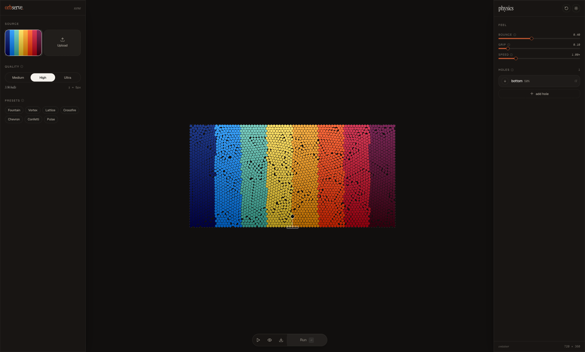

# Orbserve

Orbserve turns an image into a physics-driven field of colored particles. Choose a source image, tune how the particles move, adjust where they enter the canvas, then export the finished motion as a video.



## Development

```bash
npm install
npm run dev
```

Build for production:

```bash
npm run build
```

## Tech

- [Rapier](https://rapier.rs/) for the 2D physics simulation.
- [PixiJS](https://pixijs.com/) for fast canvas/WebGL rendering.

## Note

This project was generated with the help of AI.
